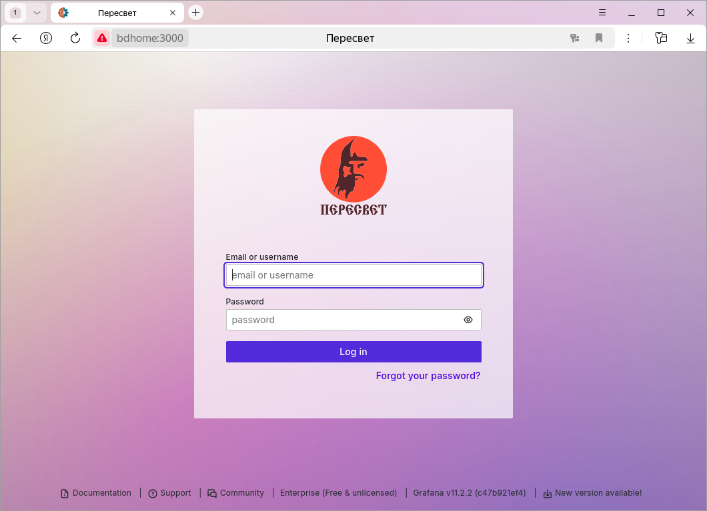
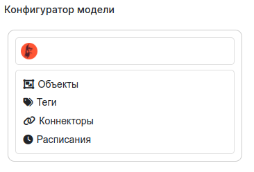

<div style="text-align: center;">
   
</div>

# Содержание

---

1. [`Описание`](#description)
2. [`Различие в версиях`](#versions)
3. [`Запуск платформы`](#running)
4. [`Примеры использования`](#examples)
5. [`Отладка`](#debugging)
6. [`Генерация документации`](#make_docs)

---

**Полная текущая документация доступна по адресу https://vovaman.github.io/peresvet/.**
**В настоящее время документация обновляется каждый раз,**
**когда в ветку разработки `dev` добавляется**
**новая функциональность.**

# <a name="description"></a>Описание

**Пересвет** - платформа-конструктор для создания моделей технических объектов и информационных систем.
Область применения: 

1. Промышленная автоматизация уровней SCADA, диспетчеризация/мониторинг, MES.
2. Умный дом, умное здание.
3. Создание программно-аппаратных комплексов
4. И т.д.

Главная задача - построение модели технического объекта.

Основные сущности, которыми оперирует модель: объект, тег, тревога, метод, коннектор, хранилище данных.
Этих сущностей достаточно для построения моделей, решающих множество задач: мониторинг, часть задач MES.

Кроме этого, модель может быть расширена дополнительными сущностями для моделирования более сложных
объектов и процессов.

Платформа может использоваться для сбора, хранения, обработки данных, а также
автоматизации процессов, протекающих в рамках технического объекта.

Отличия от баз данных реального времени (Prometheus, VictoriaMetrics и т.д.):

1. Инфраструктура. Платформа представляет собой, в первую очередь,
   инфраструктурную надстройку над базой данных реального времени,
   т.е. предлагает создание иерархии объектов, каждый из которых обладает
   набором параметров (тэгов).
2. Расчётные тэги. У объекта могут быть параметры, которые рассчитываются
   на основании других параметров.
3. Внешние расчётные методы. К событиям, происходящим в платформе
   (изменения тэгов; тревоги; расписания) могут быть привязаны как
   расчётные методы тэгов, так и просто внешние методы,
   запускающие какие-либо внешние процессы.
4. Платформа позволяет не только собирать внешние данные, но и записывать
   (через коннекторы) данные во внешние источники.
   Таким образом, на базе платформы можно строить SCADA-системы,
   системы управления умным домом и т.д.

Говоря в общем, платформа Пересвет, в отличие от большинства баз данных
реального времени, нацелена не столько на сбор метрик,
сколько на автоматизацию технических объектов.

# <a name="versions"></a>Различие в версиях
Существуют две версии платформы: открытая и для промышленного применения.

Отличия промышленной версии:

1. Одновременная поддержка нескольких хранилищ данных разного типа (PostgreSQL, Victoriametrics, и т.д.).
2. Полноценные масштабирование и высокая доступность.
3. Отделение функционала по созданию модели от среды исполнения.
4. Готовые модели для решения задач в области промавтоматизации.
5. Работа с промышленными протоколами передачи данных.
6. Инструменты для работ с большими моделями.

# <a name="running"></a> Запуск платформы

## Системные требования

1. Ubuntu 22.04, Ubuntu 24.04.
2. Установленный [Docker Engine](https://docs.docker.com/engine/install/ubuntu/) 
   с выполненными [шагами после установки](https://docs.docker.com/engine/install/linux-postinstall/).
3. При первом запуске необходим доступ в интернет для скачивания docker-образов.

> :warning: Для запуска платформы должны быть свободны порты 80, 443 и 3000.

## Шаги запуска

1. Копируем платформу со [страницы релизов](https://github.com/Vovaman/peresvet/releases).
2. Распаковываем архив в локальную папку.
3. Заходим в папку с распакованным архивом и запускаем на исполнение скрипт:
   
   ```console
   $ ./run_one_app.sh
   ```
4. Открываем браузер и в строке адреса вводим: http://localhost/grafana.

   <div style="text-align: center;">
      
   </div>
   
   > :warning: Имя пользователя и пароль по умолчанию: user=admin, password=admin.
   > При первом входе в систему Grafana предложит сменить пароль.

5. По умолчанию откроется панель с конфигуратором системы.

<div style="text-align: center;">
   
</div>

Инструкции по работе с конфигуратором 
[здесь](https://vovaman.github.io/peresvet/configurator.html).

# <a name="examples"></a> Примеры использования

Примеры работы с платформой собраны в отдельном проекте 
[peresvet_examples](https://github.com/Vovaman/peresvet_examples).

Проект постоянно пополняется.

# <a name="debugging"></a> Отладка

Для отладки платформы необходимо создать виртуальное окружение проекта с помощью инструмента
[pipenv](https://pipenv.pypa.io/en/latest/).

После установки `pipenv` заходим в папку проекта и выполняем команду 

```console
$ pipenv install
```

Теперь запускаем все контейнеры, кроме сервисов платформы, скриптом

```console
$ ./run_one_app_debug.sh
```

Далее открываем файл ``src/services/one_app/one_app.py``, это главный исполняемый файл платформы,
и запускаем его в режиме отладки.

# <a name="make_docs"></a> Генерация документации

Перед генерацией документации необходимо также, как и в случае с отладкой, сначала создать виртуальное окружение проекта.

После создания виртуального окружения заходим в папку ``docs`` и выполняем команду 

```console
$ make html
```

В результате в каталоге ``docs/build/html`` будет сгенерирована HTML-документация на проект.


