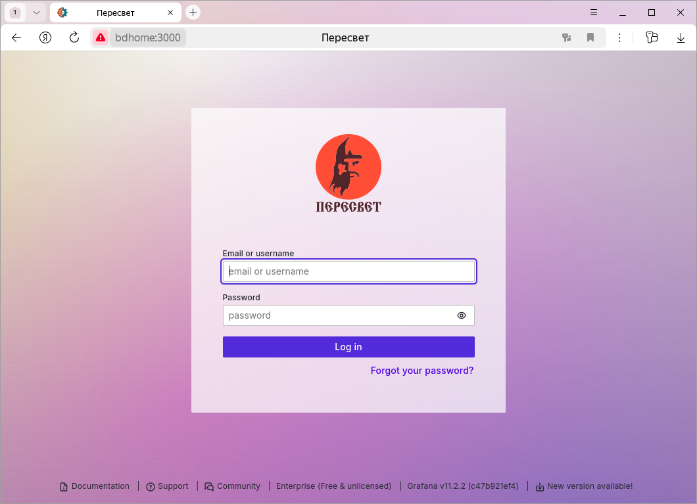
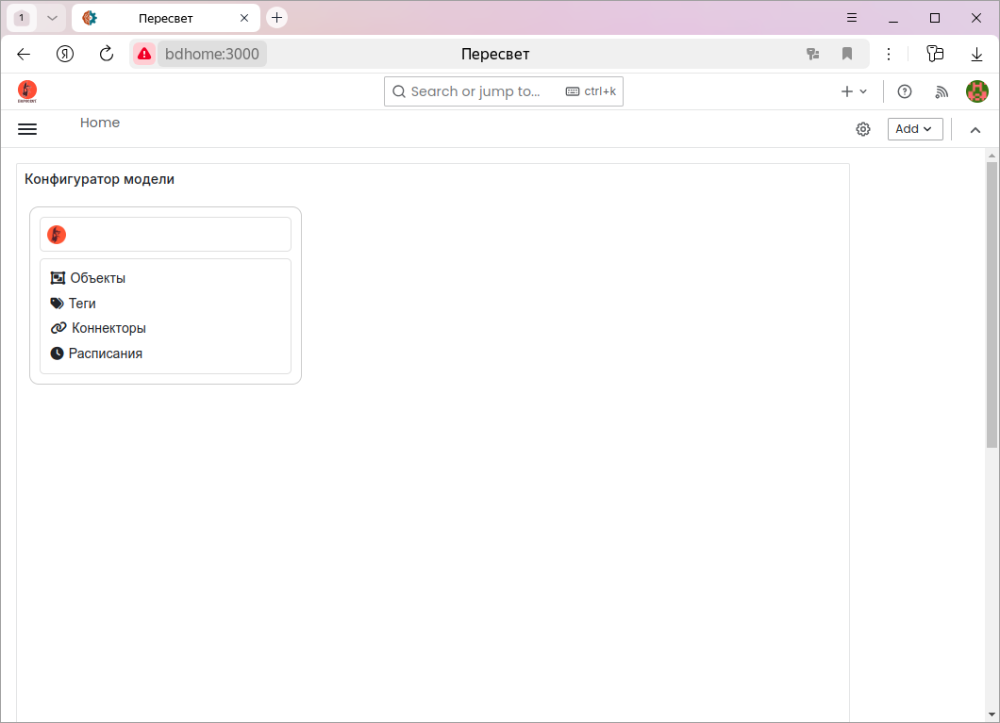
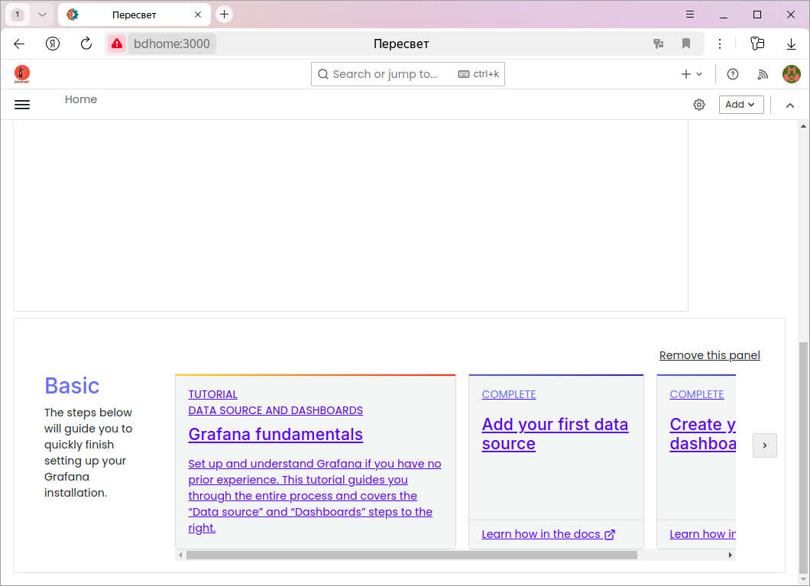
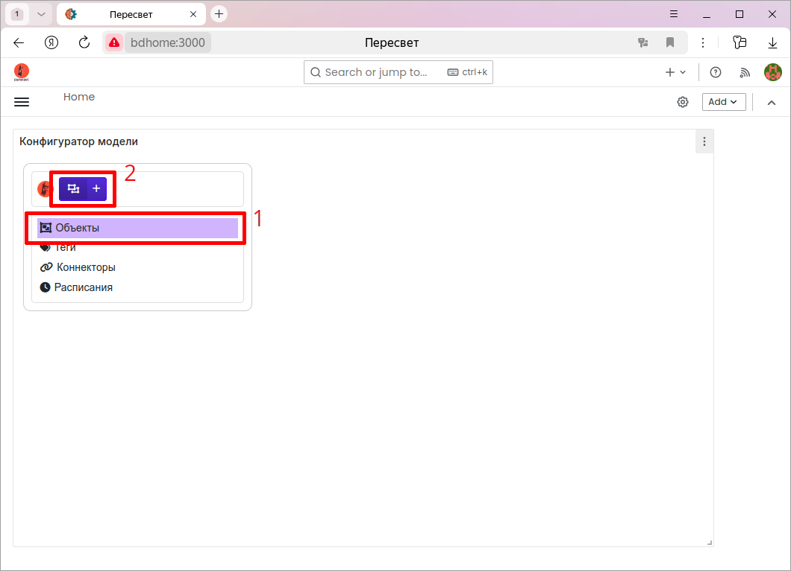
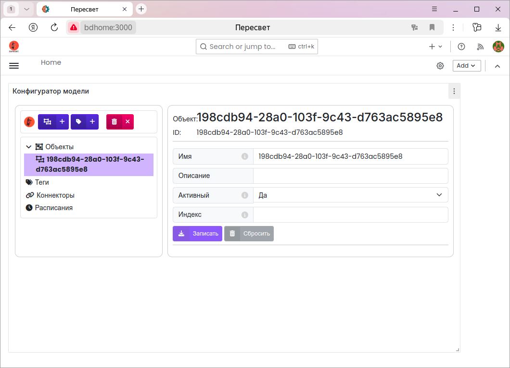
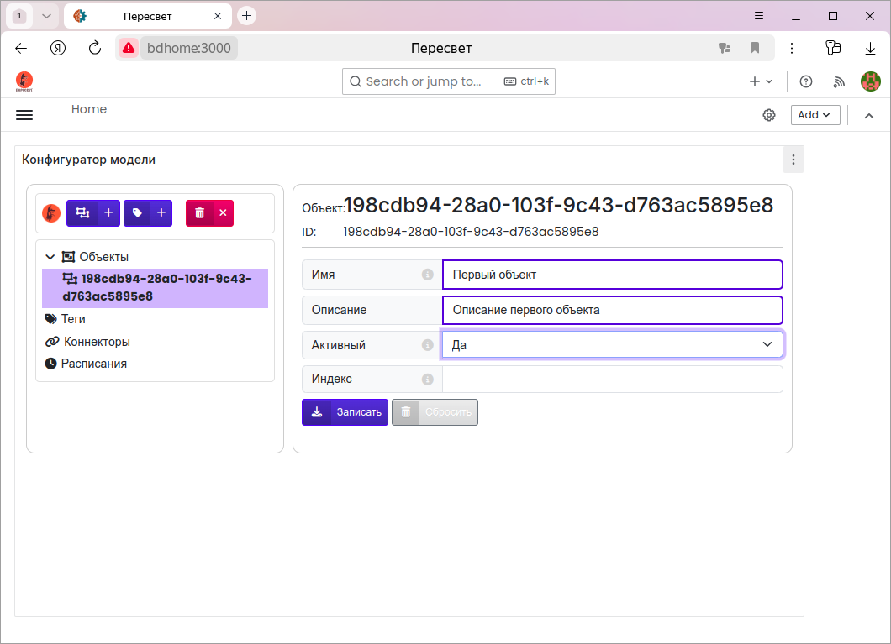
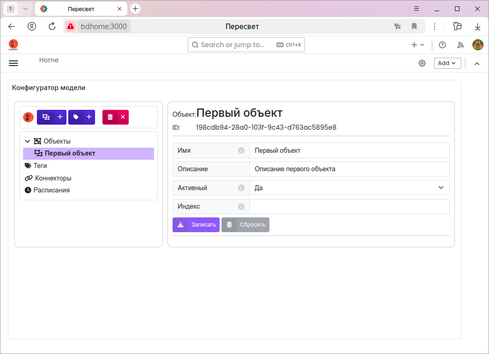

.. _configurator:

Конфигуратор модели
-------------------

.. note::
   Конфигуратор работает с платформой через :ref:`API <api>`.
   Форматы всех команд создания/чтения/обновления/удаления узлов иерархии
   можно найти в документации по указанной ссылке.

Первый запуск
^^^^^^^^^^^^^
Запускаем платформу (:ref:`installation`).

Запускаем браузер и в строке адреса пишем: http://localhost/grafana.

При первом запуске вводим имя пользователя ``admin``, пароль также ``admin``.
Grafana предложит сменить пароль.

По умолчанию открывается экран с конфигуратором.

При первом запуске в низ экрана атоматически добавляется панель, которую можно удалить:

Папки модели
^^^^^^^^^^^^
Создаваемая модель объекта и информационной системы имеет иерархическую структуру.

На верхнем уровне иерархии находятся узлы, в которых создаются экземпляры соответствующих 
:ref:`сущностей <entity>`.

Проще освоить работу с конфигуратором на :ref:`примерах <examples>`.

Объекты
_______
Внутри этой папки создаётся основная иерархия - модель объекта. Иерархия имеет любой уровень 
вложенности и может включать в себя объекты, теги, тревоги, методы.

Теги
____
Наиболее простой случай модели объекта - это линейный список его параметров (тегов).

В таком случае теги можно создавать, не привязывая их к какому-либо объекту.

Для этого случая служит отдельная папка ``Теги``.

Коннекторы
__________
В этой папке создаются описания :ref:`коннекторов <definition_connector>`.
Параметры, задаваемые в узле-описании коннектора, зависят от конкретного коннектора.

Расписания
__________
Папка для создания расписаний - генераторов событий.

Хранилища данных
________________
Папка, в которой хранятся описания хранилищ данных. 
Исторические данные, факты возникновения, пропадания
и квитирования тревог хранятся в этих хранилищах.

.. note:: Открытая версия платформы "Пересвет" поддерживает работу только с одним хранилищем, 
   поэтому в конфигураторе для открытой платформы отсутствует узел "Хранилища данных".

Создание новых узлов
^^^^^^^^^^^^^^^^^^^^
1. Выбираем нужный узел, внутри которого хотим создать дочерний.
2. Выбираем нужную синюю кнопку и, нажав её, создаём новый экземпляр необходимой нам сущности.

После нажатия кнопки в иерархию добавится новый экземпляр выбранной сущности.
Узел в иерархии, соответствующий данному экземпляру, станет текущим и справа появится панель
со свойствами нового узла.

Кроме того, изменится набор кнопок в верхней части конфигуратора.

**Синие кнопки** показывают, экземпляры каких сущностей могут быть созданы внутри выбранного узла.

Например: внутри объекта могут быть созданы другие объекты или теги; внутри тега могут быть созданы 
методы и тревоги.

   
   Новый объект

   
   Новый тег

   
   **Красная кнопка** - удаление выбранного узла из иерархии.

При создании нового узла в иерархии с помощью конфигуратора он создаётся с параметрами по умолчанию.
Поэтому имя нового узла совпадает с его идентификатором.

Редактирование свойств узла
^^^^^^^^^^^^^^^^^^^^^^^^^^^
На панели справа редактируем свойства узла. При этом изменённые свойства обводятся синей рамкой.

Если у узла изменено хотя бы одно свойство, то активизируются две кнопки:

**Записать** - сохранение в модели изменённых свойств и

**Сбросить** - отмена внесённых изменений, возврат к начальным параметрам.

Нажимаем кнопку **Записать**:

Удаление узла
^^^^^^^^^^^^^
Выбираем нужный узел в иерархии и нажимаем красную кнопку:

Из иерархии удаляется узел и все его потомки.

Примеры
^^^^^^^
Работу в конфигураторе с отдельными сущностями проще освоить на :ref:`примерах <examples>`.