.. _examples:

Примеры
-------
Для демонстрации работы с платформой создан отдельный 
`проект <https://github.com/Vovaman/peresvet_examples>`_, пополняемый новыми примерами.

Также в указанном проекте можно создавать новые задачи с запросами на новые примеры.

Здесь рассмотрим самый простой пример.

Простой пример с одним объектом
^^^^^^^^^^^^^^^^^^^^^^^^^^^^^^^
Для демонстрации работы с объектами, тегами, методами и экранами Grafana сделаем следующий пример.

Допустим, у нас есть лампочка и мы можем тем или иным способом получить 
данные по току и напряжению (работу с коннекторами рассмотрим в следующих примерах).

Кроме тока и напряжения у лампочки есть третий, расчётный тег - мощность.

При изменении силы тока или напряжения мощность должна перерасчитываться.

1. Объект
.........
Открываем конфигуратор, выбираем папку "Объекты" и нажимаем кнопку "Новый объект":

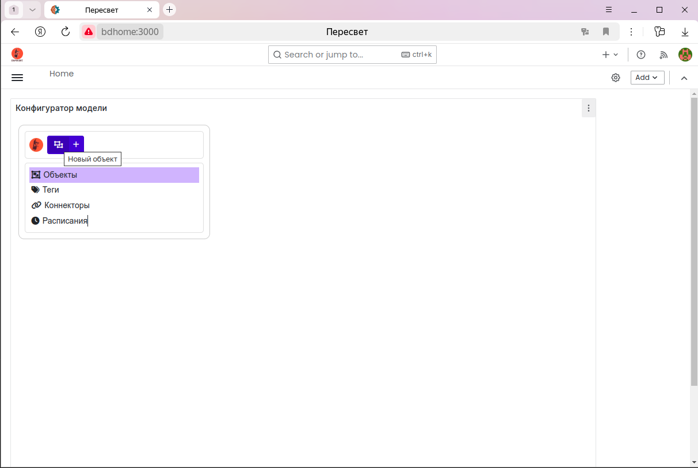

В появившемся окне свойств меняем имя объекта на "Лампочка"... 

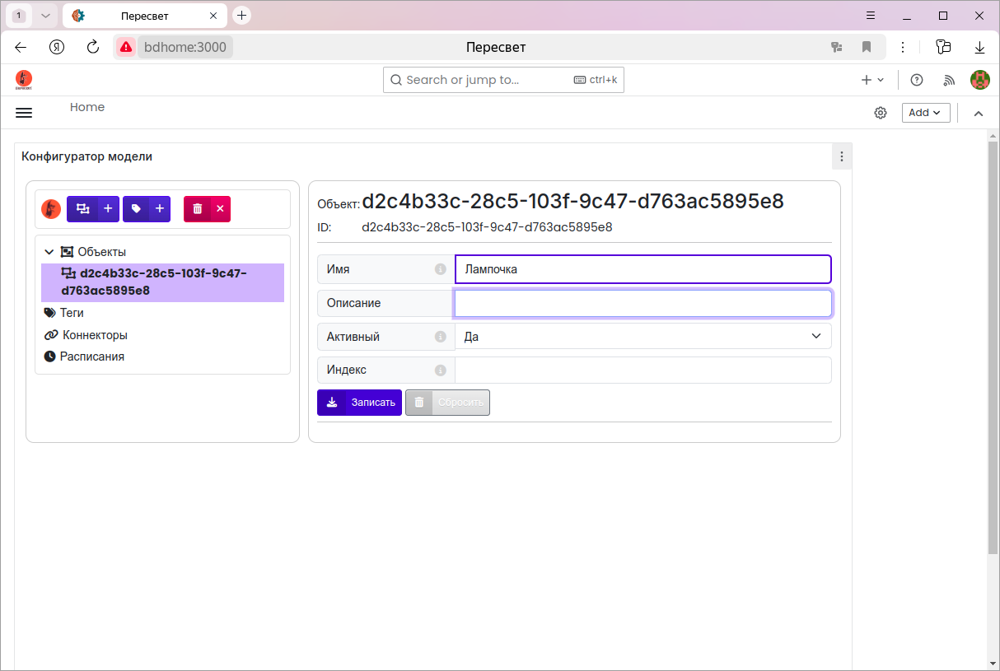

...и, нажав кнопку "Записать", сохраняем изменения:

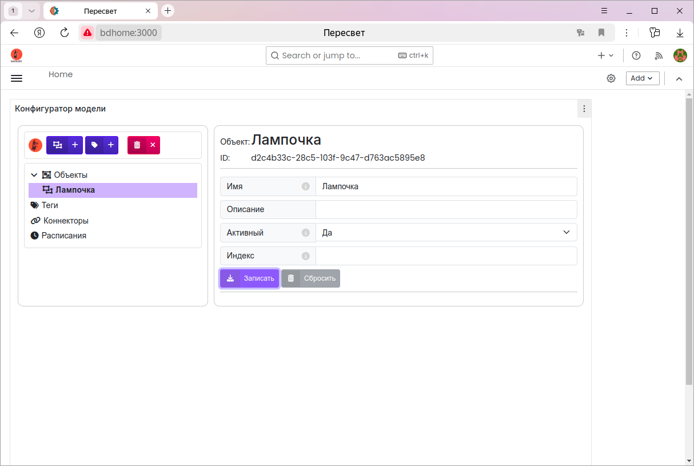

2. Теги
.......
Оставляя текущим объектом "Лампочку", нажимаем кнопку "Новый тег":

Меняем имя тега и единицы измерения...

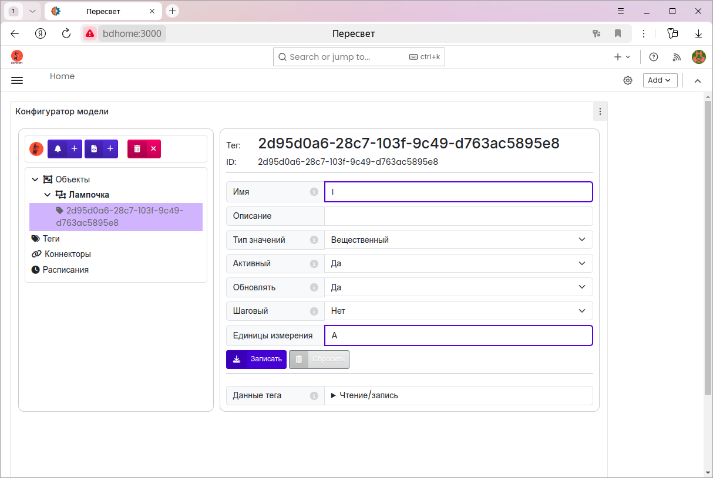

...и, нажав кнопку "Записать", сохраняем изменения:

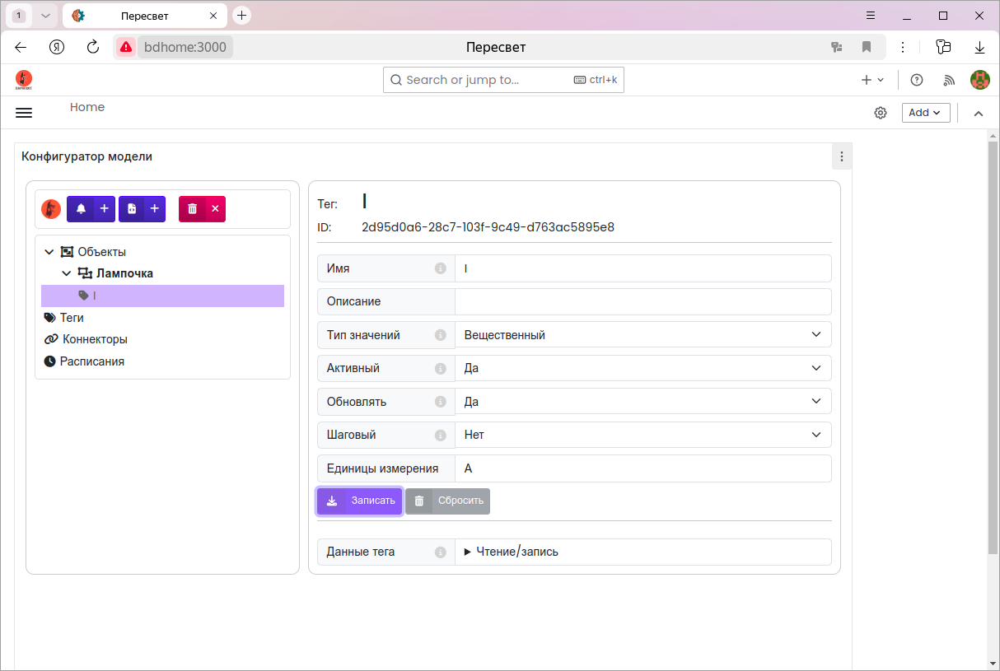

Аналогичным образом создаём ещё два тега, U и P:

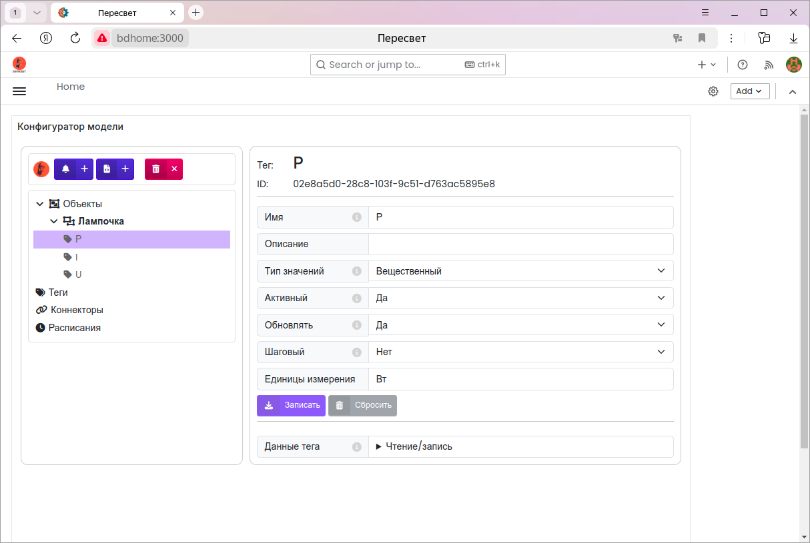

3. Запись/чтение данных
.......................
Проверим, что данные в теги записываются и читаются.

Выберем тег "I" и откроем панель "Данные тега":

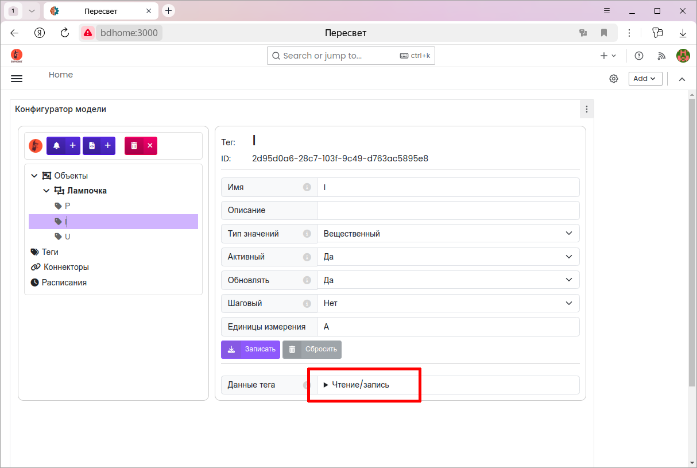

#. В поле "Значение" впишем 0.
#. В поле "body" можно посмотреть сформированное тело запроса на запись.

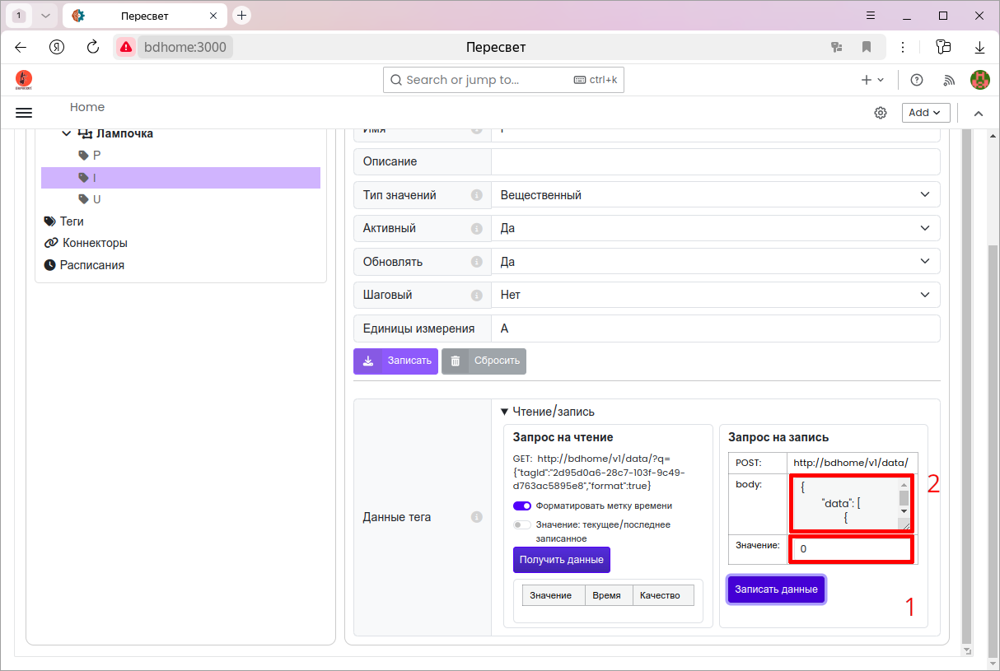

Нажимаем кнопку "Записать", затем "Получить данные".

В таблице "Значение-время-качество" появится текущее значение тега "I":

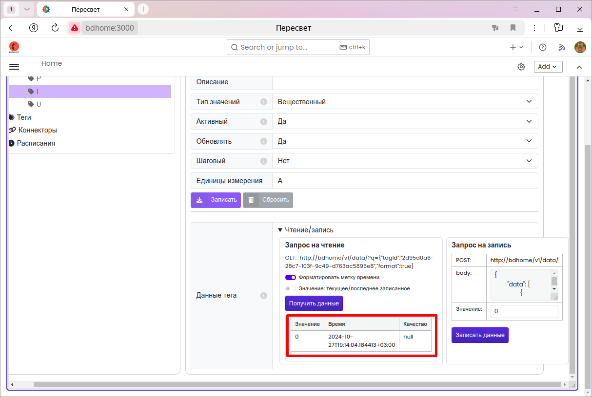

4. Расчётный метод
..................
Создадим метод для расчёта мощности лампочки.

Для этого выберем тег "P" и нажмём кнопку "Новый метод":

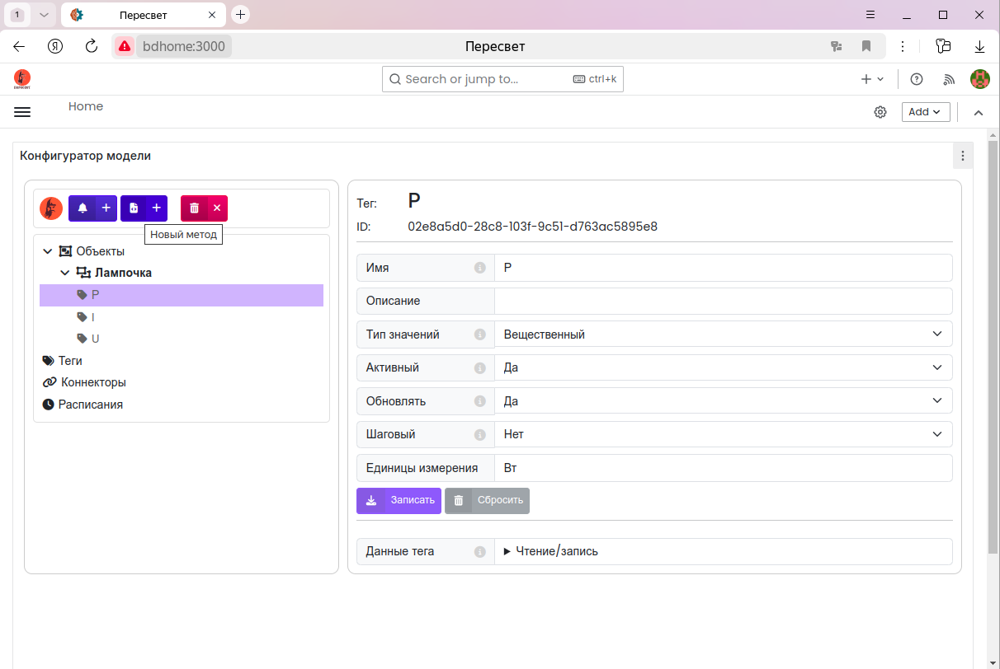

Затем:

1. Изменим имя метода
2. В поле "Адрес" введём название метода, под которым он будет зарегистрирован в системе для вызовов. 
   Запомним это имя - ``power``:

   .. figure:: pics/12.method_name_address.png

3. Блок "Инициаторы". Очень важный блок, в котором мы выбираем, какие события могут инициировать выполнение
   расчётного метода.

   Здесь выберем оба предложенных тега: I и U, то есть изменения обоих этих тегов будут приводить к 
   перерасчёту мощности.

   .. attention:: Обратите внимание, что в списке возможных инициаторов расчёта нет самого тега
      "P": изменение тега не может приводить к перерасчёту его самого, так как это вызовет бесконечный цикл
      расчётов.

   .. figure:: pics/13.method_initiators.png

4. Укажем, какие данные необходимо передать методу для расчёта.
   
   Данные, передаваемые в метод в каждом параметре - это результат запроса 
   :py:meth:`получения данных <tags_app_api_svc.data_get>`.

   Для расчёта мощности нужны текущие значения двух тегов: силы тока и напряжения. 
   Поэтому создаём два параметра, дважды нажав на синюю кнопку с плюсом.
   Заполняем данные параметров как показано на картинке:

   .. figure:: pics/14.method_parameters.png

   Здесь мы указали, что в метод передаются два параметра: первым (индекс = 1) - сила тока.

   Вторым (индекс = 2) - напряжение.

   Поле "Конфигурация" заполняется автоматически после выбора тега в поле "Тег".

   .. attention:: После изучения документации на запрос 
      :py:meth:`получения данных <tags_app_api_svc.data_get>` можно вручную править поле "Конфигурация",
      составляя сколь угодно сложные запросы получения данных. Поле "Конфигурация" можно расширять 
      для удобства ввода текста.

      .. figure:: pics/15.extend_config.png

   .. attention:: Очень важный момент, относящийся к расчётам значений тегов: тег мощности рассчитывается,
      когда изменяется значение тегов "I" и "U". Допустим, расчёт инициируется изменением тега "I" и метка
      времени нового значения "I" - "2024-10-27 10:00:00+03:00". В этом случае запрос данных в параметрах 
      будет производиться также на метку времени "2024-10-27 10:00:00+03:00" и новое рассчитанное значение 
      тега мощности также будет записано с этой меткой времени, не смотря на то, что сам расчёт, возможно, 
      будет производиться в другое время.

5. Нажимаем кнопку "Записать" для сохранения изменений:

   .. figure:: pics/16.save_method.png

Теперь напишем код метода.

В папке ``methods`` проекта https://github.com/Vovaman/peresvet уже написан метод для этого примера.

Откроем файл ``methods/test_method.py`` и рассмотрим метод ``calc_power``:

.. code-block:: python

    @rpc("power")
    async def calc_power(I: dict, U: dict) -> float:
        """Метод возвращает произведение двух параметров.

        """
        print(f"I: {json.dumps(I, indent=4)}")
        print(f"U: {json.dumps(U, indent=4)}")

        cur_I = I["data"][0]["data"][0][0]
        cur_U = U["data"][0]["data"][0][0]

        if cur_I == None or cur_U == None:
            return 0
        
        return cur_I * cur_U

.. attention:: Первая строка: ``@rpc("power")``: именно "power" мы вводили в поле 
   "Адрес" при создании метода!

Далее - строка объявления метода: ``async def calc_power(I: dict, U: dict) -> float:``.
Первым параметром указана сила тока, вторым - напряжение. Точно так же, как мы указывали
индексы у параметров.

Далее метод просто для удобства выводит в консоль пришедшие данные, затем рассчитывает мощность
как произведение двух параметров.

5. Запуск расчётного метода
...........................
Для запуска метода необходимо установить пакеты, указанные в файле ``methods/requirements.txt`` либо
для всех пользователей:

.. code-block:: bash

   $ pip3 install -r requirements.txt

Либо создав виртуальную среду проекта.

После установки пакетов запускаем в терминале скрипт в папке ``methods``:

.. code-block:: bash

   $ python3 test_method.py

Результат должен быть примерно таким:

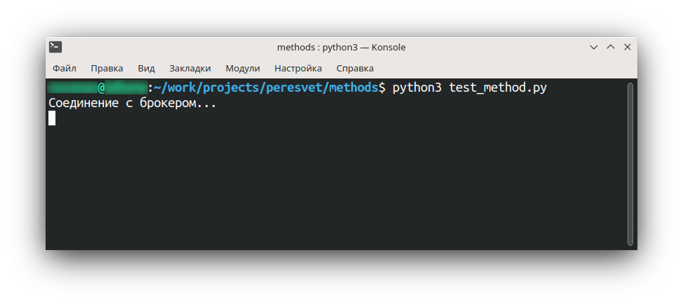

6. Проверим расчёт
..................
Помним, что расчёт мощности инициируется изменениями значений тока и напряжения.

Запишем в тег "U" значение 230.

Для этого выберем в иерархии тег "U" и запишем в него требуемое значение:

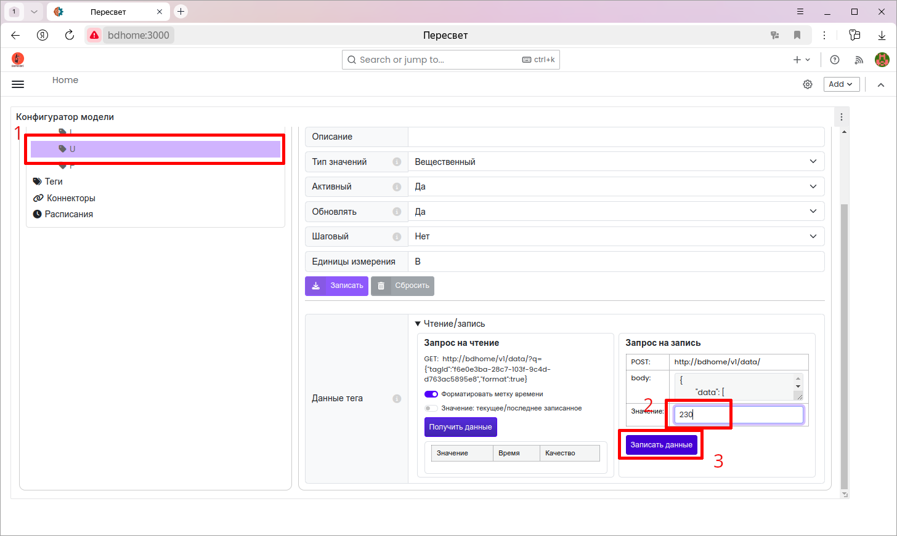

В консоли, в которой мы запустили метод, появится вывод:

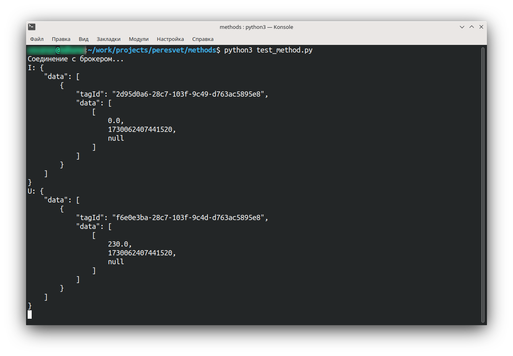

Проверим значение тега мощности "P". Оно должно быть равно 0, так как перед этим
в тег "I" мы записали 0:

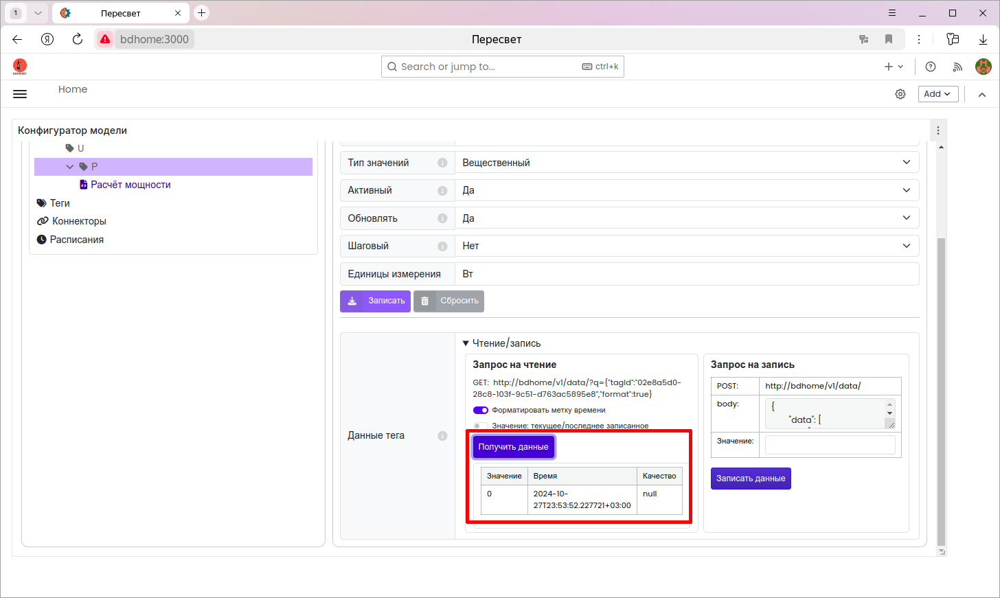

Теперь запишем в тег "I" значение 1:

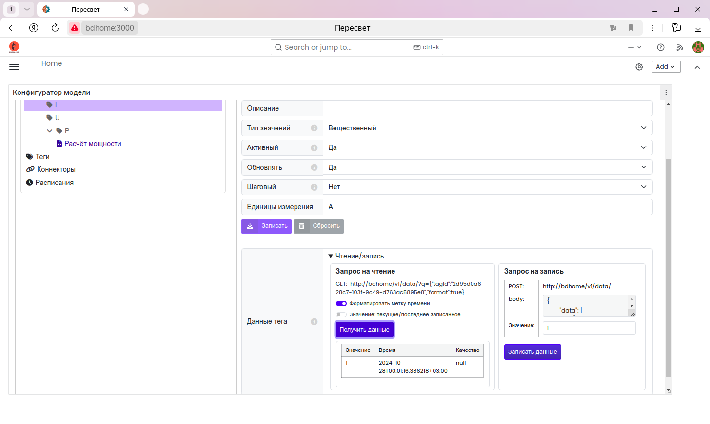

И проверим значение мощности, которое должно быть равно 230 Вт:

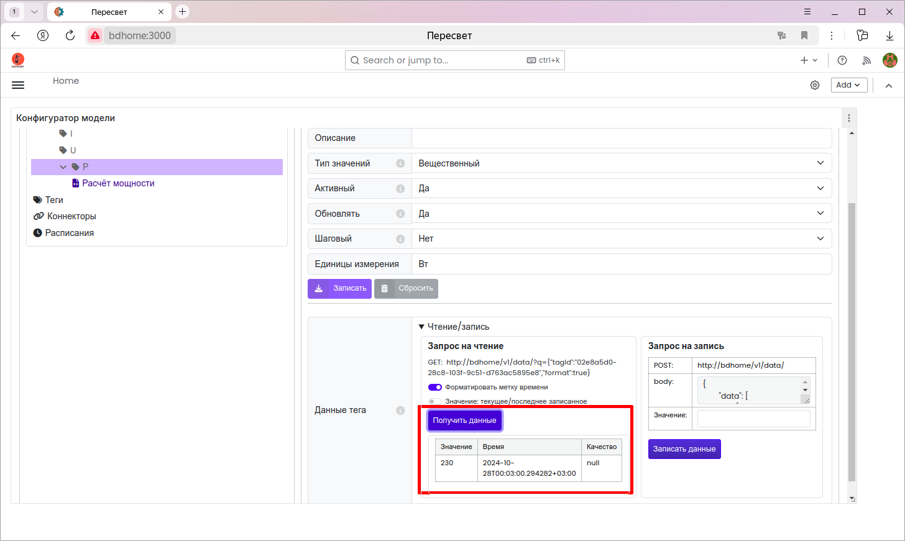

.. note:: В следующих примерах будет показано, как настроить получение данных в теги
   из внешних источников.

7. Отображение данных в Grafana
...............................
.. note:: Данные из платформы можно получать 
   :py:meth:`описанным в документации запросом <tags_app_api_svc.data_get>`.

   Данные тегов (как, впрочем, и всё общение с платформой) приходят в виде json и для манипулирования
   этими данными в Grafan'е рекомендуется изучить языки манипулирования json-данными
   `JSONata <https://docs.jsonata.org/overview.html>`_ или
   `JSONPath <https://jsonpath.com/>`_.

   Предпочтительнее JSONata, так как обладает большими возможностями.

   Настроим отображение:
   
   * текущих значений тегов "I", "U" и "P";
   * трендов значений этих тегов;
   
1. Создадим новую доску данных.
   
   Для этого заходим в меню "Home --> Dashboards" и нажимаем кнопку "New"

   .. figure:: pics/23.new_dashboard.png

   Выбрав в выпадающем меню команду "New dashboard", попадаем на экран создания новой панели:

   .. figure:: pics/24.new_panel.png

   ...и выбираем источник данных "peresvet":

   .. figure:: pics/25.ds.png
   
2. В появившемся окне настройки панели выберем тип панели "Stat". 

   .. figure:: pics/26.stat.png

3. Настроим путь для получения данных, вписав ``/data/`` на закладке ``Path``.

   .. note:: По умолчанию в источнике данных "peresvet" настроен путь к 
      платформе: ``http://<server>/v1/``.
      Добавляя к этому пути расширения ``data``, ``objects``, ``tags`` и т.д., 
      мы получаем возможность работать не только с данными, но и вообще
      со всеми сущностями платформы.

   .. figure:: pics/27.path.png

4. Настроим запросы получения данных.
   
   Для того, чтобы не писать запрос вручную, его можно скопировать из конфигуратора.

   Открываем конфигуратор, выбираем тег "I" и копируем запрос получения текущего значения тега.

   .. figure:: pics/28.q.png

   В окне настройки панели выбираем закладку "Params" и добавляем новый ключ "q". 
   Значение ключа - скопированный нами запрос:

   .. figure:: pics/29.params.png

    Далее:
     
    #. Переходим на закладку "Fields";
    #. Меняем имя очереди на "I";
    #. Вводим выражение на языке JSONPath, разбирающее ответ от платформы с текущим значением тега
    #. На экране появится "1" - текущее, введённое нами на предыдущих шагах значение тока.

    .. figure:: pics/30.data.png

    Повторим предыдущие шаги для оставшихся двух тегов напряжения и мощности,
    добавляя новые запросы нажатием кнопки "Add query":

    .. figure:: pics/31.add_query.png

    .. warning:: У каждого поля отменим кэширование данных:

       .. figure:: pics/39.cache.png
    
5. Окончательная настройка панели.
   
   После настройки данных значения напряжения и мощности отображаются красным цветом.
   Так выставлены настройки по умолчанию. 
   
   #. Чтобы все значения отражались зелёным цветом, уберём порог значения "80";

      .. figure:: pics/32.remove_threshold.png

   #. Переименуем панель и нажмем кнопку "Save":

      .. figure:: pics/33.save.png

      Появится окно, в котором нужно задать имя доски данных.

   .. warning:: Чтобы на панели рядом с именем тега не отображался 0, введите в поля
      ``Alias`` пробел:

      .. figure:: pics/35.space.png

6. Выровняем новую панель на экране и создадим новую панель, с трендом, для чего 
   выберем команду "Add --> Visualization":

   .. figure:: pics/34.trend.png

7. Настройка панели с трендом.

   Тип панели оставим по умолчанию - "Time series".

   Получение данных настроим похоже предыдущей панели, за исключением того, что ключ запроса "q"
   будет включать функции Grafan'ы ``$__isoFrom()`` и ``$__isoTo()``, обозначающие начало и конец
   запрашиваемого временного периода:

   ``q={"tagId":"2d95d0a6-28c7-103f-9c49-d763ac5895e8","format":true,"start":"$__isoFrom()","finish":"$__isoTo()"}``.

   Закладки "Fields" у всех трёх запросов должны быть такого вида:

   .. figure:: pics/36.trend_fields.png

8. Выбор временных периодов.
   
   Настроив панель с трендом для отображения трёх тегов, приведём доску данных приблизительно к такому
   виду и выберем диапазон времени для отображения на экране, а также периодичность обновления данных:

   .. figure:: pics/37.periods.png

9. Проверим работу модели. Для чего записываем новые значения в теги "I" и "U" и наблюдаем 
   изменение данных на панели с электрическими параметрами:

   .. figure:: pics/38.check.png
   